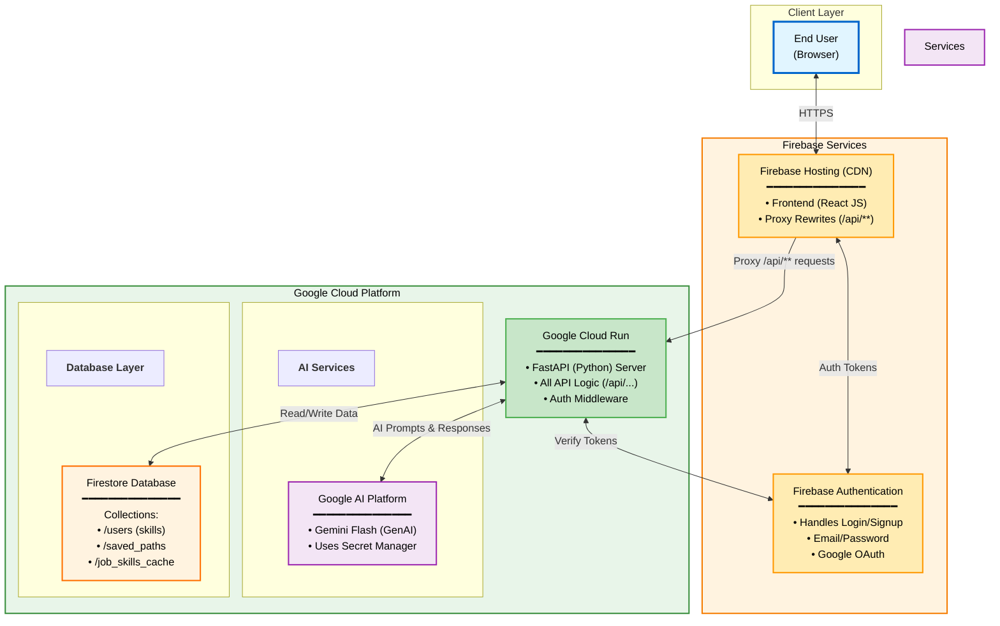

# Career Craft: AI Career Advisor

## Live Application: https://pcsr-v2.web.app

Career Craft is an intelligent, full-stack web application that acts as a personalized career advisor. It uses Google's Gemini AI to analyze a user's skills against their career goals, providing personalized job suggestions and actionable, step-by-step career roadmaps.

The application's primary goal is to empower users with a clear, personalized plan to navigate from their current position to their desired career.

## Core Features

  * **AI Job Suggestions:** Users can upload a resume (PDF/DOCX) to receive a tailored list of recommended jobs, complete with match scores and AI-parsed skills.
  * **Dynamic Career Path Generation:** Users receive a detailed, step-by-step plan for a target job, including milestones, new skills to learn, and recommended actions.
  * **Skill Gap Analysis:** Manually input skills and a target job to see which skills are matching and which are missing.
  * **Personalized Dashboard:** Securely save generated career paths to a user profile to review them later, and delete them when no longer needed.

-----

## Technical Architecture

This project uses a decoupled, full-stack architecture hosted entirely on the Google Cloud Platform.

  * **Frontend:** A **React (Vite)** single-page application. It is responsible for all UI rendering and user interaction.
  * **Backend:** A **FastAPI (Python)** asynchronous API server. It handles all business logic, authentication, and communication with the AI and database.
  * **AI Model:** **Google Gemini Flash** is used via its Python SDK to perform all generative tasks (parsing, suggesting, and planning).
  * **Database:** **Google Firestore** (NoSQL) is used to store user data, saved career paths, and cache AI responses.
  * **Hosting & Proxy:** **Firebase Hosting** serves the static React application. Its **rewrite rules** are used as a proxy, securely forwarding all API calls (e.g., `/api/**`) to the backend service.
  * **Backend Infrastructure:** **Google Cloud Run** hosts the containerized FastAPI backend, allowing it to scale independently.
  * **Authentication:** **Firebase Authentication** handles user sign-up, login (including Google OAuth), and secure token verification.

-----


## Application Workflows

Below are the text-based flows for the application's core features. All API requests are securely proxied through Firebase Hosting to the Cloud Run backend.

## WorkFlow
```mermaid
flowchart TD
    Start([User Opens Application])
    
    %% Workflow 1
    W1_Start["WORKFLOW 1:<br/>Job Suggestion"]
    W1_1["User uploads<br/>resume.pdf"]
    W1_2["Frontend attaches token<br/>POST /api/suggest-jobs"]
    W1_3["Backend verifies token<br/>& parses PDF"]
    W1_4["Sends text to<br/>Gemini AI"]
    W1_5["Gemini returns:<br/>{parsed_skills,<br/>suggestions}"]
    W1_6["Backend saves skills<br/>to Firestore"]
    W1_7["Backend returns<br/>job suggestions"]
    W1_8["Frontend renders<br/>jobs & skills"]
    
    %% Workflow 2
    W2_Start["WORKFLOW 2:<br/>Career Path"]
    W2_1["User enters skills<br/>& target job"]
    W2_2["Frontend attaches token<br/>POST /api/generate-path"]
    W2_3["Backend verifies<br/>token"]
    W2_4["Sends data to<br/>Gemini AI"]
    W2_5["Gemini returns:<br/>{milestones,<br/>next_skills, actions}"]
    W2_6["Backend returns<br/>path data"]
    W2_7["Frontend renders<br/>career path"]
    
    %% Workflow 3A
    W3A_Start["WORKFLOW 3A:<br/>Save Path"]
    W3A_1["User clicks<br/>Save this Path"]
    W3A_2["Frontend attaches token<br/>POST /api/save-path"]
    W3A_3["Backend verifies<br/>token"]
    W3A_4["Creates document in<br/>saved_paths collection"]
    W3A_5["Returns<br/>200 OK"]
    
    %% Workflow 3B
    W3B_Start["WORKFLOW 3B:<br/>View Saved Paths"]
    W3B_1["User clicks<br/>Saved Paths"]
    W3B_2["Frontend attaches token<br/>GET /api/my-paths"]
    W3B_3["Backend verifies token<br/>& queries Firestore"]
    W3B_4["Returns list of<br/>saved paths"]
    W3B_5["Frontend renders<br/>saved paths"]
    
    %% Main flow
    Start --> W1_Start
    Start --> W2_Start
    Start --> W3A_Start
    Start --> W3B_Start
    
    %% Workflow 1 connections
    W1_Start --> W1_1 --> W1_2 --> W1_3 --> W1_4 --> W1_5 --> W1_6 --> W1_7 --> W1_8
    
    %% Workflow 2 connections
    W2_Start --> W2_1 --> W2_2 --> W2_3 --> W2_4 --> W2_5 --> W2_6 --> W2_7
    
    %% Workflow 3A connections
    W3A_Start --> W3A_1 --> W3A_2 --> W3A_3 --> W3A_4 --> W3A_5
    
    %% Workflow 3B connections
    W3B_Start --> W3B_1 --> W3B_2 --> W3B_3 --> W3B_4 --> W3B_5
    
    %% Cross-workflow interactions
    W1_8 -.->|Can proceed to| W2_1
    W2_7 -.->|Can proceed to| W3A_1
    W3A_5 -.->|Can view| W3B_1
    
    %% Styling
    style Start fill:#e1f5ff,stroke:#0066cc,stroke-width:3px,color:#000
    
    style W1_Start fill:#ff9800,stroke:#e65100,stroke-width:3px,color:#000
    style W1_1 fill:#e1f5ff,stroke:#0066cc,stroke-width:2px,color:#000
    style W1_2 fill:#ffecb3,stroke:#ff9800,stroke-width:2px,color:#000
    style W1_3 fill:#c8e6c9,stroke:#4caf50,stroke-width:2px,color:#000
    style W1_4 fill:#c8e6c9,stroke:#4caf50,stroke-width:2px,color:#000
    style W1_5 fill:#f3e5f5,stroke:#9c27b0,stroke-width:2px,color:#000
    style W1_6 fill:#c8e6c9,stroke:#4caf50,stroke-width:2px,color:#000
    style W1_7 fill:#c8e6c9,stroke:#4caf50,stroke-width:2px,color:#000
    style W1_8 fill:#ffecb3,stroke:#ff9800,stroke-width:2px,color:#000
    
    style W2_Start fill:#4caf50,stroke:#2e7d32,stroke-width:3px,color:#000
    style W2_1 fill:#e1f5ff,stroke:#0066cc,stroke-width:2px,color:#000
    style W2_2 fill:#ffecb3,stroke:#ff9800,stroke-width:2px,color:#000
    style W2_3 fill:#c8e6c9,stroke:#4caf50,stroke-width:2px,color:#000
    style W2_4 fill:#c8e6c9,stroke:#4caf50,stroke-width:2px,color:#000
    style W2_5 fill:#f3e5f5,stroke:#9c27b0,stroke-width:2px,color:#000
    style W2_6 fill:#c8e6c9,stroke:#4caf50,stroke-width:2px,color:#000
    style W2_7 fill:#ffecb3,stroke:#ff9800,stroke-width:2px,color:#000
    
    style W3A_Start fill:#9c27b0,stroke:#6a1b9a,stroke-width:3px,color:#000
    style W3A_1 fill:#e1f5ff,stroke:#0066cc,stroke-width:2px,color:#000
    style W3A_2 fill:#ffecb3,stroke:#ff9800,stroke-width:2px,color:#000
    style W3A_3 fill:#c8e6c9,stroke:#4caf50,stroke-width:2px,color:#000
    style W3A_4 fill:#c8e6c9,stroke:#4caf50,stroke-width:2px,color:#000
    style W3A_5 fill:#c8e6c9,stroke:#4caf50,stroke-width:2px,color:#000
    
    style W3B_Start fill:#c2185b,stroke:#880e4f,stroke-width:3px,color:#000
    style W3B_1 fill:#e1f5ff,stroke:#0066cc,stroke-width:2px,color:#000
    style W3B_2 fill:#ffecb3,stroke:#ff9800,stroke-width:2px,color:#000
    style W3B_3 fill:#c8e6c9,stroke:#4caf50,stroke-width:2px,color:#000
    style W3B_4 fill:#c8e6c9,stroke:#4caf50,stroke-width:2px,color:#000
    style W3B_5 fill:#ffecb3,stroke:#ff9800,stroke-width:2px,color:#000
